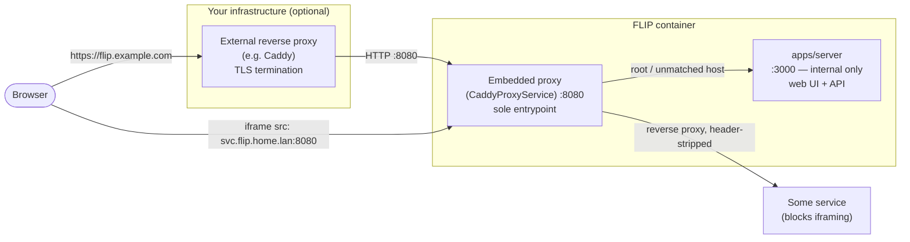

# FLIP

**F**ast **L**ocal **I**frame **P**anel(s) — a self-hosted dashboard shell. Put every service on your LAN — Sonarr, Jellyfin, Pi-hole, Home Assistant, a router admin page — behind one window, grouped into workspaces, switchable without ever reloading a frame.

[MIT licensed](./LICENSE)

<!-- TODO: screenshot/GIF of the shell (spine + sidebar + frame) and the HUD in action -->

---

## Features

- **Instant, no-reload switching** — every embeddable service's iframe stays mounted in the background, across every workspace; switching the active one is a pure visibility toggle, so embedded apps never reload, re-authenticate, or lose scroll position
- **Workspaces** — group services into workspaces (each service belongs to exactly one); switch workspaces from the 46px spine on the left
- **Press-`` ` ``-to-search HUD** — press the backtick key anywhere to raise a full-screen tile grid; press it again (or Escape) to dismiss. Type to filter every service across every workspace, arrow keys to move, Enter to open
- **Human-editable config** — services, workspaces, and settings live in plain YAML files (`services.yaml`, `workspaces.yaml`, `config.yaml`), not a database. Hand-edit them directly, or use the Settings UI — both write to the same files, and comments you add are preserved
- **Live sync** — changes made anywhere (the Settings UI, another browser tab, or a hand-edited YAML file) push to every open view instantly over SSE
- **Latency-aware health checks** — each service is periodically checked against its own URL (or a separate health-check URL if you set one) and an "OK codes" list; status is a real latency reading — fast / ok / slow / down — not just up/down
- **Add-service probing** — paste a URL and FLIP checks reachability, reads the page title, and detects whether the service refuses to be embedded (`X-Frame-Options`/CSP), auto-suggesting "open in a new tab" (or, if the embedded proxy below is configured, staying embedded via the proxy instead) when it does
- **Embedded header-stripping proxy** — a per-service toggle routes a stubborn service's iframe through FLIP's own bundled Caddy proxy, which strips/rewrites the `X-Frame-Options`/CSP headers refusing to be framed, instead of only offering "open in a new tab" or requiring you to run a separate reverse proxy yourself
- **Real drag-and-drop** — reorder services, move a service to a different workspace, and reorder workspaces themselves, all by dragging
- **Hide without deleting** — mark a service hidden to keep its config around without showing it in the switcher

---

## Getting started

**Prerequisites:** [Bun](https://bun.sh) v1.3+ and [Caddy](https://caddyserver.com) v2 — FLIP's embedded Caddy proxy (see [Architecture](#architecture)) is the sole entrypoint in dev too, so it's a required local dependency, not just a production/Docker one. This repo already pins tool versions with [Mise](https://mise.jdx.dev) (`mise.toml`), so the easiest path is:

```bash
mise install
```

```bash
# 1. Install dependencies
bun install

# 2. Start the dev server
bun run dev
```

The data directory (`./data/services.yaml`, `./data/workspaces.yaml`, `./data/config.yaml`) is created automatically on first boot, with one example service and one workspace — no separate setup step needed. FLIP is reachable at a single address, `http://localhost:8080` — the embedded Caddy proxy in front of everything (see [Architecture](#architecture)); Vite (`:5173`) and the API server (`:3000`) are internal upstreams behind it, not meant to be visited directly.

If startup logs show Caddy failing to bind its admin API (`listen tcp 127.0.0.1:2019: bind: address already in use`), something else on your machine already owns port `2019` — set `CADDY_ADMIN_PORT` to a free port instead of hunting down the conflict.

### Editing config by hand

Open `data/services.yaml` or `data/workspaces.yaml` in an editor while FLIP is running — changes are picked up live and pushed to any open browser tab. Each field is documented with a comment in the generated file. CRUD actions taken through the Settings UI write back to the same files, preserving comments on entries you didn't touch. `Settings → Config` shows a live, read-only, syntax-colored view of the actual files on disk.

---

## Deploying behind a reverse proxy

FLIP's embedded Caddy proxy (`CaddyProxyService`) is the single network entrypoint — one published port for the web UI, the API, and (when configured) per-service subdomains alike. An external reverse proxy in front of FLIP is optional and only needed for TLS termination on a real domain; it always talks to FLIP's one published port, never bypasses it:



Root/unmatched-host traffic (the main UI and `/api/*`) always routes through the embedded proxy to `apps/server`, which is no longer reachable directly. Per-service subdomains (`PROXY_PORT`/`PROXY_DOMAIN`, see [Embedding services that block iframing](#embedding-services-that-block-iframing)) share the same published port, routed by hostname.

### Example: docker-compose + an external Caddy for TLS

A minimal production setup: FLIP built from this repo's Dockerfile, fronted by an external Caddy instance that terminates HTTPS for a real domain (Caddy provisions the certificate automatically via Let's Encrypt — nothing FLIP-specific to configure).

```yaml
# docker-compose.yml
services:
  flip:
    build: .
    restart: unless-stopped
    expose:
      - "8080"
    # environment:
    #   PROXY_DOMAIN: flip.home.lan   # optional — only needed for the per-service subdomain proxy
    volumes:
      - flip-data:/data

  caddy:
    image: caddy:2
    restart: unless-stopped
    depends_on:
      - flip
    ports:
      - "80:80"
      - "443:443"
    volumes:
      - ./Caddyfile:/etc/caddy/Caddyfile:ro
      - caddy-data:/data
      - caddy-config:/config

volumes:
  flip-data:
  caddy-data:
  caddy-config:
```

```
# Caddyfile
flip.example.com {
	reverse_proxy flip:8080
}
```

`flip` doesn't publish any port to the host at all here — only `expose`s `8080` on the compose network, since the external `caddy` service is the only thing meant to reach it. If you also enable the per-service subdomain proxy (`PROXY_DOMAIN`, above), its wildcard DNS record should point at the host running the external `caddy` service (not `flip` directly), since that's now the only publicly reachable port. And since `caddy` is terminating HTTPS for FLIP's own origin here, embedding a plain-HTTP per-service target will hit the browser's mixed-content block, per the "Plain HTTP only" note below — the two features can coexist, but only for services you're fine reaching over plain HTTP.

---

## Embedding services that block iframing

Some self-hosted apps send `X-Frame-Options`/`Content-Security-Policy` response headers that refuse to be put in an iframe at all — the usual workaround is running a separate reverse proxy in front of that one app just to strip those headers. FLIP can do this itself instead, via a bundled Caddy process, one per-service toggle at a time:

1. Set `PROXY_DOMAIN` (e.g. `flip.home.lan`) on the FLIP container, and create a **one-time wildcard DNS record** — `*.flip.home.lan` → the container's IP — on whatever DNS server your LAN already uses. This is the only network setup step; no per-app configuration is needed afterward.
2. Nothing extra to map — FLIP's single published port (`PROXY_PORT`, defaults to `8080`) already carries this traffic too: `docker run ... -p 8080:8080 -e PROXY_DOMAIN=flip.home.lan flip`.
3. On the service that refuses to embed, toggle **"Route through FLIP's header-stripping proxy"** in Settings → Services (add-service probing suggests this automatically when it detects the service isn't embeddable). FLIP now loads that service's iframe from `http://<service-id>.flip.home.lan:8080/` instead of its real URL — Caddy reverse-proxies to the real service behind the scenes, stripping the headers that were blocking it.

**Plain HTTP only** — the embedded proxy doesn't terminate TLS. If FLIP's own origin is served over HTTPS by an external front-proxy, embedding a plain-HTTP iframe target will hit the browser's mixed-content block; this setup is intended for LAN-only/plain-HTTP deployments.

---

## Usage

### 1. Add your services

Open `http://localhost:8080/settings/services/add` (or click **+ Add service** from `Settings → Services`).

- Paste a URL — FLIP probes it for reachability, page title, and iframe-embeddability, and pre-fills a suggested name and "open externally" setting accordingly.
- Pick a name, a 2-letter tile mark, and a tile colour.
- Assign it to a workspace.
- Optionally set a separate **health check URL**, custom **OK codes**, and a check **interval**.

### 2. Organize workspaces

`Settings → Workspaces` shows a board — one column per workspace. Drag a service card between columns to move it to a different workspace; drag a column header to reorder workspaces.

### 3. Switch between services

Navigate to `http://localhost:8080`. The **spine** (far left) switches workspaces; the **sidebar** lists the current workspace's services — click one to bring it to the front. Every embeddable service's iframe is already loaded in the background, so switching is instant.

Press **`` ` ``** anywhere to raise the HUD: a full-screen tile grid of the current workspace (or, once you start typing, every service across every workspace). Arrow keys move, Enter opens, Escape or pressing `` ` `` again dismisses.

## Project structure

```
flip/
├── apps/
│   ├── web/         # SvelteKit frontend (shell, HUD, settings)
│   ├── server/      # Elysia REST API
│   └── bootstrap/   # Ensures the data directory and default YAML files exist on startup
├── packages/
│   ├── store/       # YAML-backed data layer (services, workspaces, config) — no database
│   ├── env/         # Shared environment variable schemas
│   └── config/      # Shared TypeScript config
```

---

## Scripts

| Command | Description |
|---|---|
| `bun run dev` | Start web and server in development mode |
| `bun run build` | Build all apps |
| `bun run data:reset` | Wipe the local data directory and recreate it with defaults |
| `bun run check` | Run Biome lint + format checks |
| `bun run check-types` | TypeScript type-check across all packages |
| `bun run test` | Run server unit tests |
| `bun run test:coverage` | Run server unit tests with coverage reporting |
| `bun run test:e2e:install` | One-time: download the Chromium browser Playwright needs |
| `bun run test:e2e` | Run the Playwright end-to-end suite |
| `bun run docker` | Build the production Docker image and run it locally |
| `bun run docker:stop` | Stop and remove the local Docker container started by `docker` |

---

## End-to-end testing

Playwright specs live in `apps/web/e2e/`: service CRUD in Settings, service/workspace switching (verifying iframes stay mounted across a switch), and the HUD's press-to-search keyboard flow.

```bash
# One-time: download the Chromium browser
bun run test:e2e:install

# Run the suite
bun run test:e2e
```

This spins up the server and web dev servers for you (Playwright's `webServer` config) against a **disposable, seeded data directory** (`apps/web/e2e/.e2e-data/`, gitignored) — never your own `data/`.

**Don't run `bun run test:e2e` while `bun run dev` is already up** — both bind the same ports (8080/3000/5173, since Playwright also drives the embedded Caddy proxy for real dev-path coverage).

---

## Internals

### Architecture

FLIP is a Bun monorepo with three apps that run side by side, always fronted by an embedded Caddy proxy — in both dev and prod, nothing is reachable except through it:

- **Embedded Caddy proxy** (`CaddyProxyService`, `apps/server/src/services/CaddyProxyService.ts`) — always spawned by `apps/server`, listening on `PROXY_PORT` (default `8080`), the one address anything external ever talks to. Its generated config differs by `NODE_ENV`: in prod, root/unmatched-host traffic reverse-proxies straight to `apps/server` (which already serves both the SPA and the API there); in dev, it instead splits by path — `/api/*` to `apps/server`, everything else to Vite — since the SPA and API are two separate processes there. When `PROXY_DOMAIN` is set, it additionally routes per-service subdomains for the header-stripping feature (see [Embedding services that block iframing](#embedding-services-that-block-iframing)) — those exact-host routes always take precedence over the root/catch-all route regardless of Caddyfile block order, since Caddy sorts by matcher specificity.
- **`apps/web`** (SvelteKit, `:5173` internally) — the browser-facing app, reached through the embedded proxy, never directly. `/` renders the shell (spine + sidebar + frame) and the HUD overlay; `/settings/*` renders the management UI (services, workspaces, shortcuts, config). All data fetching goes through a typed Eden Treaty client in `src/lib/api.ts`, which always targets `window.location.origin` — same-origin in both dev and prod, since the embedded proxy makes that true either way; shared reactive state (services, workspaces, active selection, HUD state) lives in `src/lib/app-state.svelte.ts`.
- **`apps/server`** (Elysia, `:3000` internally, loopback-bound) — the REST API, also reached only through the embedded proxy. Resource controllers for `services` (CRUD + reorder + a probe endpoint, embeds live health status) and `workspaces` (CRUD + reorder, cascades a deletion by reassigning member services to the next remaining workspace, refusing the deletion only if it's the last workspace left), plus `config` (read-only — also surfaces the env-derived `proxyDomain`/`proxyPort` for the embedded proxy feature, not just `config.yaml`'s contents) and `events` (SSE change/health notifications). Each resource also exposes a `/raw` endpoint returning its live YAML file text, used by the Config settings tab. OpenAPI docs are generated automatically and available at `/api/openapi`.
- **`apps/bootstrap`** — ensures `DATA_DIR` and its default YAML files exist on startup. Runs once before `apps/server` starts (see the Dockerfile `CMD`); `apps/server` also runs the same step itself as a safety net, so local dev never needs this run manually.
- **`packages/store`** — the YAML data layer shared by `apps/server` and `apps/bootstrap`. `services.yaml` holds each service's identity, tile, health-check settings, and the single workspace id it belongs to; `workspaces.yaml` holds workspace identity/order; `config.yaml` holds the shared health-check timeout. Reads/writes go through the `yaml` package's `Document` API rather than plain parse/stringify, so comments and formatting on untouched parts of the file survive an edit.

### Health checks

A single background scheduler in `apps/server` checks each service's health-check URL (or its own URL, if none is set) once its own `every` interval has elapsed, comparing the response status against that service's `codes` list — a response outside that list counts as down, same as a timeout or network error. The result — a latency reading in milliseconds (or `null` for down) plus a derived bucket (`fast` / `ok` / `slow` / `down`, shared logic in `packages/store/src/health-bucket.ts`) — is kept in memory only. Status is never written to YAML: it resets after a restart, which keeps the config files stable and avoids racing with file-watching. Status is pushed live to open browser tabs over the same SSE channel used for data changes.

### The HUD

Pressing `` ` `` is a toggle, not a hold gesture: a global keydown listener in the root layout (`src/routes/+layout.svelte`) opens the HUD on the first press and closes it on the next, so it stays up while you type. It ignores the key entirely when focus is inside a form field, so typing a literal backtick into a URL doesn't summon it. While open, arrow keys/Shift+arrow keys/Enter/Escape/printable characters are all handled by that same listener, not by the visible search field (which is a controlled *display* of the typed query, not an editable input) — this matches the product's intent of being drivable without moving real keyboard focus.

### Extending FLIP

The `services` resource (`packages/store/src/services.ts`, `apps/server/src/{controllers,services,db}/*Services*`) is the reference implementation for adding another YAML-backed resource — see `CLAUDE.md`'s New feature checklist — the repo's contributor/AI-agent conventions doc — for the step-by-step pattern.

---

## Tech stack

| Package | Role |
|---|---|
| [Bun](https://bun.sh) | Runtime and package manager |
| [SvelteKit](https://kit.svelte.dev) | Frontend framework — file-based routing, reactive UI |
| [Elysia](https://elysiajs.com) | Type-safe HTTP framework for the API server |
| [Caddy](https://caddyserver.com) (Apache-2.0) | Embedded header-stripping proxy — FLIP's sole network entrypoint, bundled as a binary in the Docker image |
| [yaml](https://eemeli.org/yaml/) | Human-editable YAML data files — no database process required |
| [Biome](https://biomejs.dev) | Linting and formatting (replaces ESLint + Prettier) |
| [Vite+](https://viteplus.dev) | Monorepo task runner built on Vite/Rolldown |
| [svelte-dnd-action](https://github.com/isaacs/svelte-dnd-action) | Drag-and-drop reordering — service lists, the workspace board, workspace order |
| [Catppuccin](https://catppuccin.com) | Base colour ramp — Mocha, the only theme |
| Oswald + Fira Code | Display type (names, labels) and mono type (numbers, machine strings), loaded from Google Fonts |
| [Zod](https://zod.dev) | On-disk YAML shape validation, OpenAPI JSON-schema generation, and env-var validation (route validation itself uses Elysia's TypeBox) |
| [Playwright](https://playwright.dev) | End-to-end browser testing |
