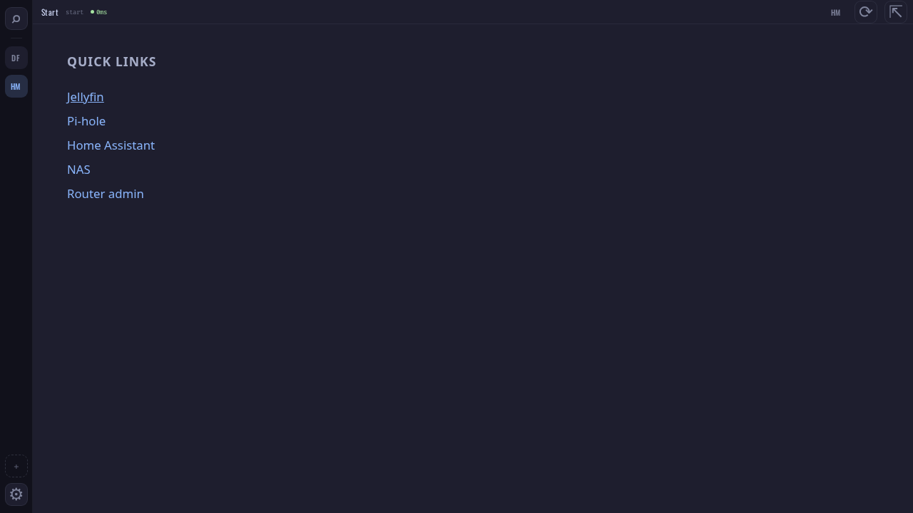
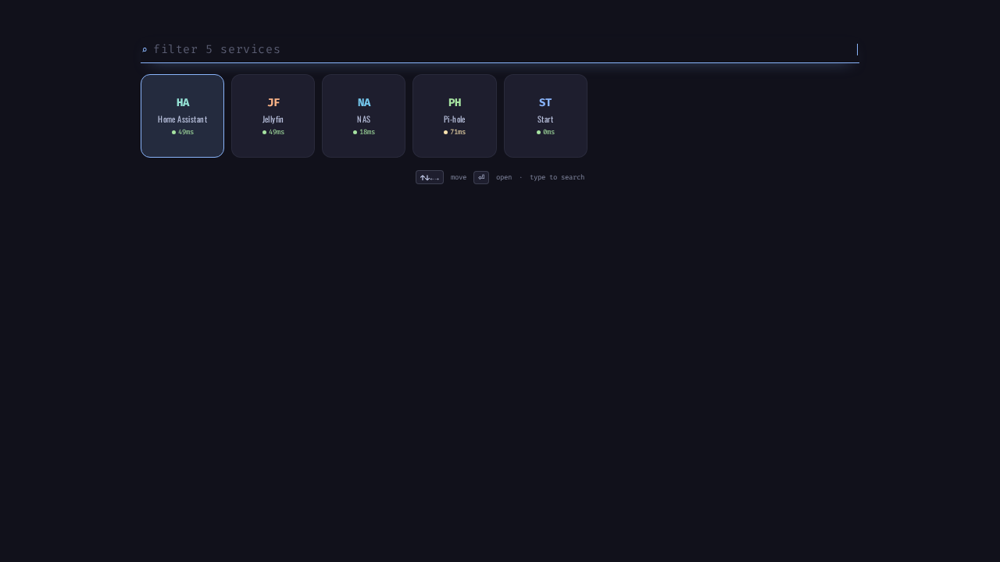
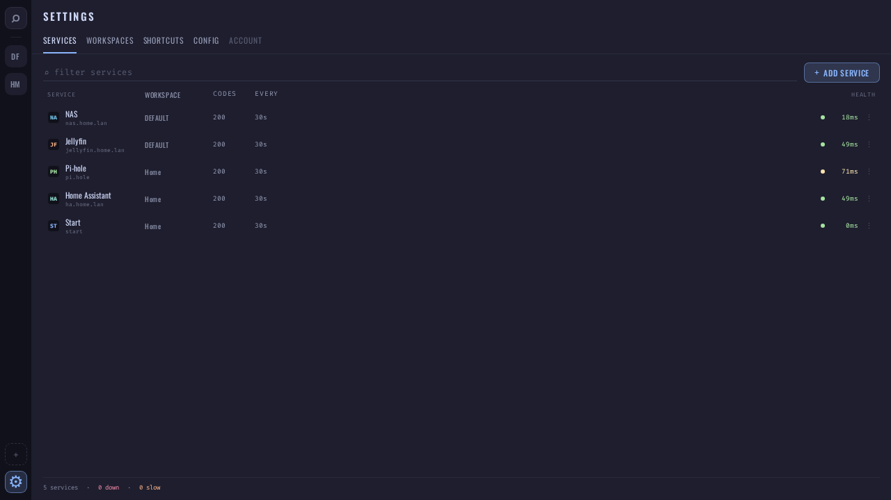
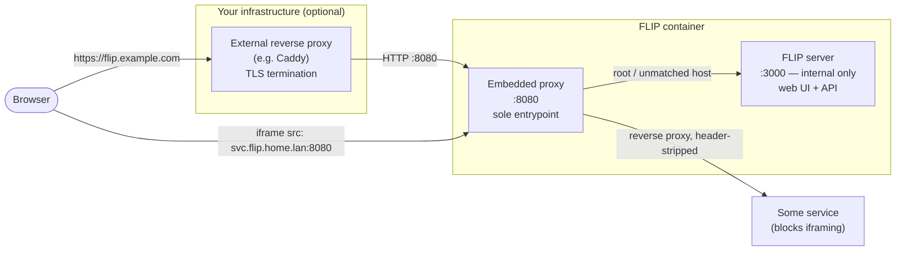

# FLIP

**F**ast **L**ocal **I**frame **P**anel(s) — a self-hosted dashboard shell. Put every service on your LAN — a NAS, Jellyfin, Pi-hole, Home Assistant, a router admin page — behind one window, grouped into workspaces, switchable without ever reloading a frame.

[MIT licensed](./LICENSE)

|                                              |                                  |                                                       |
| -------------------------------------------- | -------------------------------- | ----------------------------------------------------- |
|  |  |  |

<sub>Demo data, not a live install. Regenerate with `bun run docs:screenshots`.</sub>

---

## Features

- **Instant, no-reload switching** — every embeddable service's iframe stays mounted in the background, across every workspace; switching the active one is a pure visibility toggle, so embedded apps never reload, re-authenticate, or lose scroll position
- **Workspaces** — group services into workspaces (each service belongs to exactly one); switch workspaces from the 46px spine on the left
- **Press-`` ` ``-to-search HUD** — press the backtick key anywhere to raise a full-screen tile grid; press it again (or Escape) to dismiss. Type to filter every service across every workspace, arrow keys to move, Enter to open
- **Human-editable config** — services, workspaces, and settings live in plain YAML files (`services.yaml`, `workspaces.yaml`, `config.yaml`), not a database. Hand-edit them directly, or use the Settings UI — both write to the same files, and comments you add are preserved
- **Live sync** — changes made anywhere (the Settings UI, another browser tab, or a hand-edited YAML file) push to every open view instantly over SSE
- **Latency-aware health checks** — each service is periodically checked against its own URL (or a separate health-check URL if you set one) and an "OK codes" list; status is a real latency reading — fast / ok / slow / down — not just up/down
- **Add-service probing** — paste a URL and FLIP checks reachability, reads the page title, and detects whether the service refuses to be embedded (`X-Frame-Options`/CSP), auto-suggesting "open in a new tab" (or, if the embedded proxy below is configured, staying embedded via the proxy instead) when it does
- **Embedded header-stripping proxy** — a per-service toggle routes a stubborn service's iframe through FLIP's own bundled Caddy proxy, which strips/rewrites the `X-Frame-Options`/CSP headers refusing to be framed, instead of only offering "open in a new tab" or requiring you to run a separate reverse proxy yourself
- **Real drag-and-drop** — reorder services, move a service to a different workspace, and reorder workspaces themselves, all by dragging
- **Hide without deleting** — mark a service hidden to keep its config around without showing it in the switcher
- **Host your own static sites** — mount a folder of pre-built HTML/CSS/JS onto the FLIP container and tile it like any other service, no separate web server or upload step needed

---

## Getting started

**Prerequisites:** [Docker](https://www.docker.com). You'll also want the ability to create custom DNS entries on your network — via your router's DNS settings, a local resolver like [Pi-hole](https://pi-hole.net), or your OS's hosts file — since FLIP is meant to embed your existing self-hosted services by their LAN hostname; this is separate from the one-time wildcard DNS record needed only if you use the optional embedded proxy for iframe-blocking services (see [Embedding services that block iframing](#embedding-services-that-block-iframing)).

Versioned images are published to GHCR on every release — no build step required:

```bash
docker run -d --name flip -p 8080:8080 -v flip-data:/data ghcr.io/damianpokorski/flip:latest
```

Pin a specific version (e.g. `ghcr.io/damianpokorski/flip:1.4.0`) instead of `latest` if you want reproducible upgrades — see [Releases](https://github.com/damianpokorski/flip/releases) for the changelog.

The data directory (`services.yaml`, `workspaces.yaml`, `config.yaml`, and an empty `sites/` folder ready for [locally-hosted static sites](#hosting-local-static-sites), all inside the `flip-data` volume) is created automatically on first boot, with one example service and one workspace — no separate setup step needed. FLIP is reachable at a single address, `http://localhost:8080`; everything — the web UI, the API, and per-service subdomains if you configure them — is served through FLIP's own embedded proxy, so there's nothing else to expose.

If container logs show Caddy failing to bind its admin API (`listen tcp 127.0.0.1:2019: bind: address already in use` — most likely if you're running more than one FLIP container on the same network namespace), set the `CADDY_ADMIN_PORT` environment variable to a free port.

Want to run FLIP from source instead — for development, or to build the image yourself? See [CONTRIBUTING.md](./CONTRIBUTING.md).

### Editing config by hand

Open `services.yaml` or `workspaces.yaml` (inside the `flip-data` volume, or `./data/` if bind-mounted) in an editor while FLIP is running — changes are picked up live and pushed to any open browser tab. Each field is documented with a comment in the generated file. CRUD actions taken through the Settings UI write back to the same files, preserving comments on entries you didn't touch. `Settings → Config` shows a live, read-only, syntax-colored view of the actual files on disk.

---

## Deploying behind a reverse proxy

FLIP's embedded Caddy proxy is the single network entrypoint — one published port for the web UI, the API, and (when configured) per-service subdomains alike. An external reverse proxy in front of FLIP is optional and only needed for TLS termination on a real domain; it always talks to FLIP's one published port, never bypasses it:



Root/unmatched-host traffic (the main UI and `/api/*`) always routes through the embedded proxy. Per-service subdomains (`PROXY_PORT`/`PROXY_DOMAIN`, see [Embedding services that block iframing](#embedding-services-that-block-iframing)) share the same published port, routed by hostname.

### Example: docker-compose + an external Caddy for TLS

A minimal production setup: FLIP running from the published GHCR image, fronted by an external Caddy instance that terminates HTTPS for a real domain (Caddy provisions the certificate automatically via Let's Encrypt — nothing FLIP-specific to configure).

```yaml
# docker-compose.yml
services:
  flip:
    image: ghcr.io/damianpokorski/flip:latest # or a pinned version
    restart: unless-stopped
    expose:
      - "8080"
    # environment:
    #   PROXY_DOMAIN: flip.home.lan   # optional — only needed for the per-service subdomain proxy
    volumes:
      - flip-data:/data
      # optional — mount a folder as a local static site (see "Hosting local
      # static sites" below); the host path (left of the colon) can be anything you like, the
      # container path must be DATA_DIR/sites/<slug>
      - ./my-page:/data/sites/my-page

  caddy:
    image: caddy:2
    restart: unless-stopped
    depends_on:
      - flip
    ports:
      - "80:80"
      - "443:443"
    volumes:
      - ./Caddyfile:/etc/caddy/Caddyfile:ro
      - caddy-data:/data
      - caddy-config:/config

volumes:
  flip-data:
  caddy-data:
  caddy-config:
```

```
# Caddyfile
flip.example.com {
	reverse_proxy flip:8080
}
```

`flip` doesn't publish any port to the host at all here — only `expose`s `8080` on the compose network, since the external `caddy` service is the only thing meant to reach it. If you also enable the per-service subdomain proxy (`PROXY_DOMAIN`, above), its wildcard DNS record should point at the host running the external `caddy` service (not `flip` directly), since that's now the only publicly reachable port. And since `caddy` is terminating HTTPS for FLIP's own origin here, embedding a plain-HTTP per-service target will hit the browser's mixed-content block, per the "Plain HTTP only" note below — the two features can coexist, but only for services you're fine reaching over plain HTTP.

---

## Embedding services that block iframing

Some self-hosted apps send `X-Frame-Options`/`Content-Security-Policy` response headers that refuse to be put in an iframe at all — the usual workaround is running a separate reverse proxy in front of that one app just to strip those headers. FLIP can do this itself instead, via a bundled Caddy process, one per-service toggle at a time:

1. Set `PROXY_DOMAIN` (e.g. `flip.home.lan`) on the FLIP container, and create a **one-time wildcard DNS record** — `*.flip.home.lan` → the container's IP — on whatever DNS server your LAN already uses. This is the only network setup step; no per-app configuration is needed afterward.
2. Nothing extra to map — FLIP's single published port (`PROXY_PORT`, defaults to `8080`) already carries this traffic too: `docker run ... -p 8080:8080 -e PROXY_DOMAIN=flip.home.lan flip`.
3. On the service that refuses to embed, toggle **"Route through FLIP's header-stripping proxy"** in Settings → Services (add-service probing suggests this automatically when it detects the service isn't embeddable). FLIP now loads that service's iframe from `http://<service-id>.flip.home.lan:8080/` instead of its real URL — Caddy reverse-proxies to the real service behind the scenes, stripping the headers that were blocking it.

**Plain HTTP only** — the embedded proxy doesn't terminate TLS. If FLIP's own origin is served over HTTPS by an external front-proxy, embedding a plain-HTTP iframe target will hit the browser's mixed-content block; this setup is intended for LAN-only/plain-HTTP deployments.

---

## Hosting local static sites

Some things you want on the dashboard aren't a running service with a URL — just a folder of static files (a status page, a small hand-written tool, a static site export). FLIP can serve those itself:

1. Mount (or bind-mount) a folder onto the FLIP container under `DATA_DIR/sites/<slug>/` — e.g. `-v ./my-page:/data/sites/my-page`. The folder must contain an `index.html` at its root; relative links to other files in the same folder (CSS, JS, images) work as usual.
2. In `Settings → Services → + Add service`, toggle **"Serve a local folder instead of a URL"** and pick `my-page` from the list.
3. The tile behaves exactly like any other service — same HUD entry, same always-mounted iframe, same health check (down if the folder or its `index.html` goes missing).

There's no upload form by design — mount or drop files in directly, the same way `services.yaml`/`workspaces.yaml` are meant to be hand-edited.

---

## Usage

### 1. Add your services

Open `http://localhost:8080/settings/services/add` (or click **+ Add service** from `Settings → Services`).

- Paste a URL — FLIP probes it for reachability, page title, and iframe-embeddability, and pre-fills a suggested name and "open externally" setting accordingly.
- Pick a name, a 2-letter tile mark, and a tile colour.
- Assign it to a workspace.
- Optionally set a separate **health check URL**, custom **OK codes**, and a check **interval**.

### 2. Organize workspaces

`Settings → Workspaces` shows a board — one column per workspace. Drag a service card between columns to move it to a different workspace; drag a column header to reorder workspaces.

### 3. Switch between services

Navigate to `http://localhost:8080`. The **spine** (far left) switches workspaces; the **sidebar** lists the current workspace's services — click one to bring it to the front. Every embeddable service's iframe is already loaded in the background, so switching is instant.

Press **`` ` ``** anywhere to raise the HUD: a full-screen tile grid of the current workspace (or, once you start typing, every service across every workspace). Arrow keys move, Enter opens, Escape or pressing `` ` `` again dismisses.

---

## Contributing

FLIP is open source under the [MIT license](./LICENSE). If you want to run it from source, understand how it's built, or send a PR, see [CONTRIBUTING.md](./CONTRIBUTING.md) — it covers the dev workflow, project structure, testing, and internals. Repo-specific conventions (commit style, linting, testing rules) are documented in [CLAUDE.md](./CLAUDE.md).
